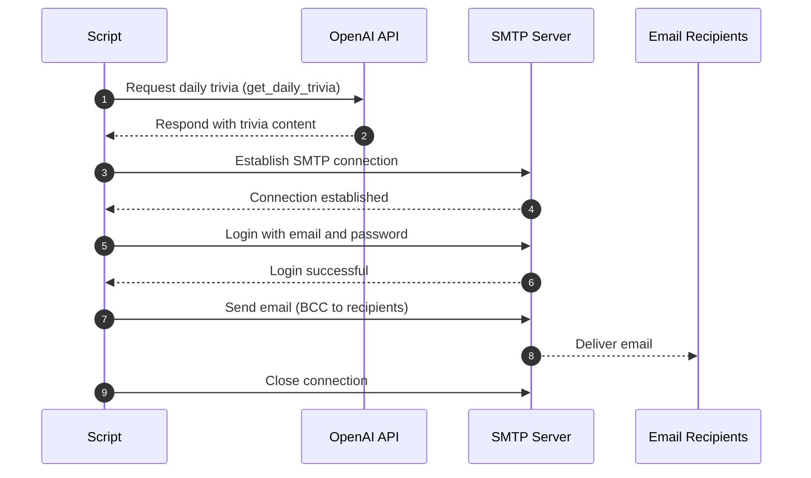

# Daily Trivia Email Bot

This project automatically sends a daily short trivia email to subscribers using OpenAI's API and SMTP.

## How It Works



## Prerequisites

- Python 3.8 or higher
- OpenAI API key
- SMTP-enabled email account (e.g., Namecheap, Gmail, etc.)
- `python-dotenv` for environment variable management

## Setup

1. Clone the repository and enter the project directory:

   ```bash
   git clone <repository-url>
   cd <project-directory>
   ```

2. Create and activate a Python virtual environment:

   ```bash
   python3 -m venv venv
   source venv/bin/activate  # On Windows: venv\Scripts\activate
   ```

3. Upgrade pip and install dependencies:

   ```bash
   python3 -m pip install --upgrade pip
   python3 -m pip install -r requirements.txt
   ```

4. Create a `.env` file in the project root with the following contents:

   ```env
   OPENAI_API_KEY=your_openai_api_key_here
   EMAIL_ADDRESS=your_email@domain.com
   EMAIL_PASSWORD=your_email_password_here
   RECIPIENTS=recipient1@example.com,recipient2@example.com
   ```

   - Use an app password or service-specific password for EMAIL_PASSWORD if required.

## Running the Script

Run the Python script directly:

```bash
python3 main.py
```

Or use the provided shell script (if available):

```bash
./main.sh
```

If you get a permission error, make the script executable:

```bash
chmod +x main.sh
```

## Automation

- Schedule the script with `cron` on macOS/Linux for daily execution.
- Or use GitHub Actions for cloud-based automation.

## Features

- Randomly selects a topic from a list based on the day of the week.
- Uses OpenAI's o4-mini model for concise trivia generation.
- Randomizes the email subject line.
- Sends emails with BCC for recipient privacy.
- Explicitly excludes trivia about strawberries, bananas, and berries in the prompt.

## Example .env

```env
OPENAI_API_KEY=sk-xxxxxxx
EMAIL_ADDRESS=bots@yunuchoi.me
EMAIL_PASSWORD=your_email_password
RECIPIENTS=hello@yunuchoi.me,bots@yunuchoi.me
```

## Notes

- SMTP server and port are set in the code (`mail.privateemail.com`, port 587).
- The email body is in Korean by default, but you can modify it for English.
- All prompt logic and topics are customizable in `main.py`.
