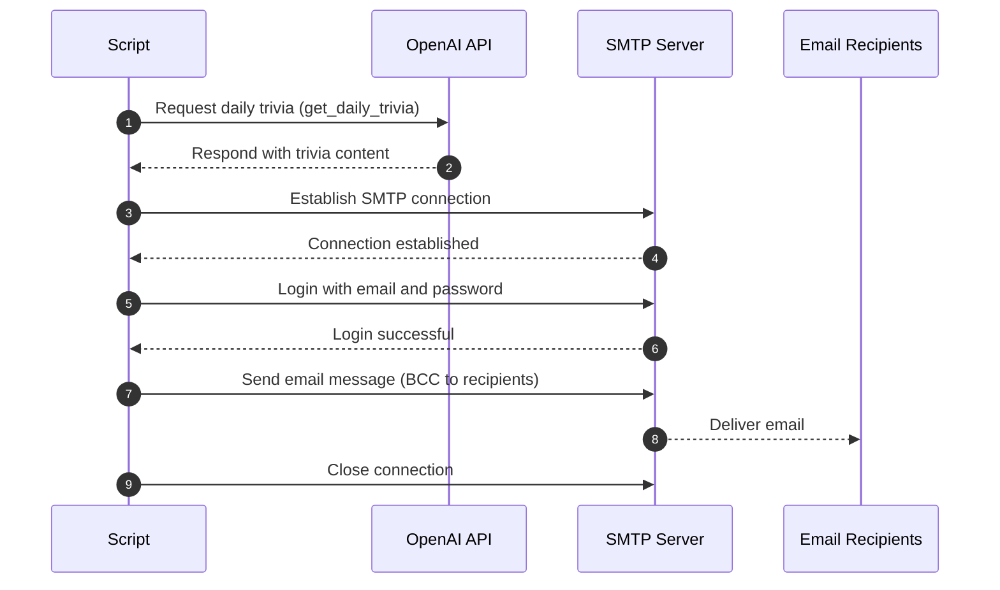

# Daily Trivia Email Bot

This project sends a daily short trivia email using OpenAI's API and Gmail SMTP.  
The email is styled with a respectful tone as befits a royal envoy.



## Prerequisites

- Python 3.8 or higher
- An OpenAI API key
- A Gmail account with app password enabled (for SMTP)
- `python-dotenv` for managing environment variables

## Setup

1. Clone the repository and navigate into the project directory:

```bash
git clone <repository-url>
cd <project-directory>
```

2. Create and activate a Python virtual environment:

```bash
bash
python3 -m venv venv
source venv/bin/activate  # On Windows: venv\Scripts\activate
```

3. Upgrade pip and install dependencies:

```bash
python3 -m pip install --upgrade pip
python3 -m pip install -r requirements.txt
```

4. Create a .env file in the project root with the following contents:

```env
OPENAI_API_KEY=your_openai_api_key_here
EMAIL_ADDRESS=your_email@gmail.com
EMAIL_PASSWORD=your_app_password_here
RECIPIENTS=recipient1@example.com,recipient2@example.com
```

Note: Use an App Password generated in your Google Account for EMAIL_PASSWORD.

## Running the Script

You may run the Python script directly:

```bash
python3 main.py
```

Or execute the provided shell script which activates the virtual environment and runs the Python script:

```bash
./main.sh
```

Make sure the shell script has execution permission:

```bash
chmod +x main.sh
```

## Automating with cron or GitHub Actions

- You may schedule the script with cron on your local machine.
- Or deploy via GitHub Actions for cloud execution without your machine running.

## Notes

- The email is sent with recipients in BCC to maintain privacy.
- The OpenAI model used is o4-mini, designed for concise and elegant replies.
